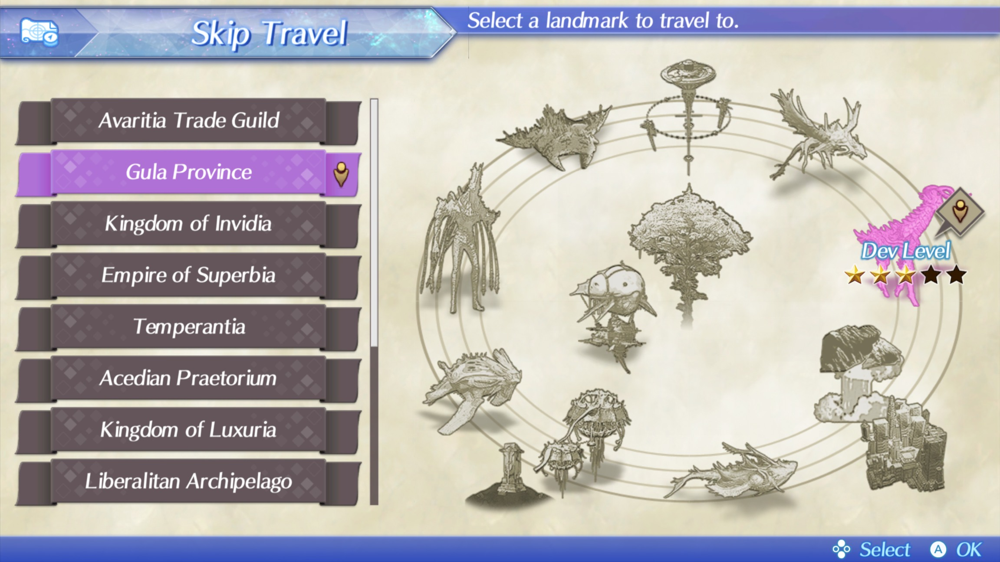
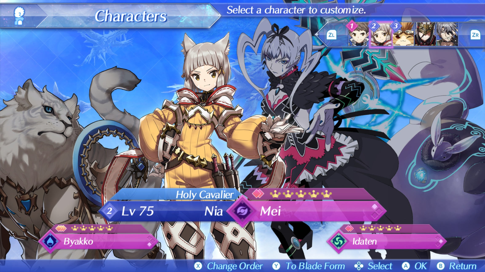
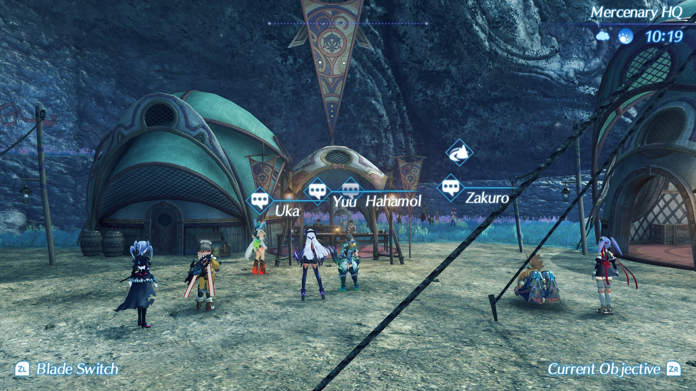
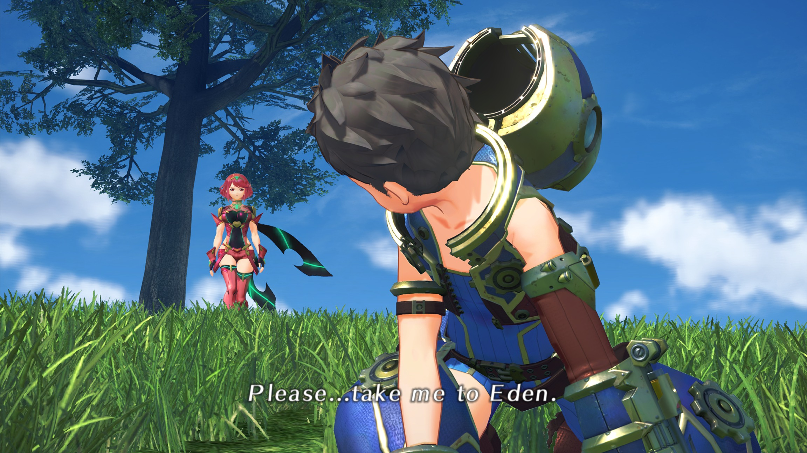

# Xenoblade 2 - Delocalization & Retranslation Patch

This project represents a passionate effort to restore Xenoblade 2 to its original vision, building upon previous delocalization work while introducing substantial improvements. While previous mods laid important groundwork, this patch goes further in preserving the game's authentic Japanese cultural elements and narrative nuances that were altered or removed in the Western release. In addition, many things that previous patches left out by accident have already been fixed (not all names and designations have been restored, leaving some only localized elsewhere in the game).

At the outset, I would like to mention that the patch is work in progress (and will remain so for a long time, unless I find a lot of people willing to help). Many things may not work as intended, some dialogues will need editing after initial translation, etc. You use at your own risk. However, any report of any bug, or providing something I have overlooked that has a significant impact on the perception of characters, story or lore will be greatly appreciated.

# A Personal Note on Project Origins

My journey with Xenoblade 2 began with the Japanese version, which I completed shortly after the Western release. This means my understanding of the characters, story, and lore comes purely from the original Japanese presentation, uninfluenced by the Western localization. Recently, I felt drawn to revisit this masterpiece and realized it was the perfect opportunity to refresh existing delocalization projects.

However, this wasn't a straightforward task. The main technical hurdle was working with Monolith Soft's proprietary BDAT file format. It wasn't until recently that I discovered a reliable method for unpacking and repacking these files. The current workflow involves processing JSON files through Notepad++ and a custom tool I developed specifically for this project that facilitates file searching, editing, and translation work.

### Prior Work
- [**Name Delocalization Mod**](https://gbatemp.net/threads/xenoblade-chronicles-2-name-de-localization.589353/)  
- [**Heart-to-Hearts Uncensored Mod**](https://varishangout.com/index.php?threads/xenoblade-chronicles-2-heart-to-hearts-uncensored-mod.2153/)  

## Core Philosophy

The fundamental goal of this patch is authenticity to the original Japanese version without compromising cultural elements for the sake of "Western accessibility." This isn't about making the game more "digestible" for the average player - the official localization already serves that purpose even removing the entire original lore and replacing it with “more appropriate” counterparts. Instead, this patch aims to preserve the rich cultural context and nuanced storytelling of the original, particularly its roots in Christian symbolism, Japanese and Chinese folklore and connections to otaku culture everyhere which were all significantly downplayed (or rather completely removed) in the Western release.

## Major Changes and Restorations (in addition to changes made in previous projects)

### Terminology Unification and Cultural Accuracy
- Restored 巨神獣 to "Divine Beast" rather than the official "Titan" - this better reflects their divine nature and connection to the game's theological themes (in the original text specifying that they are しもべ/Servants of God). 巨神獣 Means "Giant Divine Beast" but it is generally too long to fit in many places in the game interface.
- Unified all instances of 楽園 as "Eden" (in previous patches inconsistent between "Paradise", "Eden", and "Elysium" was left from localization in many places). This choice was made specifically because the game's narrative centers around humans who once lived in a fertile land with God - directly paralleling the biblical Garden of Eden
- Restored "Bonding Talk" as the proper translation for the intimate character conversations (previously localized as "Heart-to-Heart")
- Reverted "Trigo" to "Torigo"
- Restored all NPC names to their Japanese originals, preserving their cultural significance and meaning
- Completely revised and retranslated all attack names, restoring their original English, German and Italian names that were completely replaced by localizers
- Restored the World Tree's floor names to their original Talmudic references (names of Heavnes) - Vilon, Rakia, Shehaqim, and Zebul - rather than the Western localization's star-based naming system.
- Implemented proper waapuro romaji for character names, precisely - respecting long vowels (e.g., "Menou" instead of "Meno") - previous patches have mixed different methods, while I value consistency.
- Restored all instances of Hana's transformation names (e.g., "Judgement Day (JD)" instead of the localizer's "invention" - "Quantum Technochampion")
- Restored Nia's authentic characterization of Zeke, including her turtle-themed nicknames and related wordplay (such as kameatama/turtlehaed)
- Added all original Japanese honorific suffixes (-san, -sama, -chan, -kun). This was a massive undertaking but rather essential for Xenoblade 2, as these suffixes are frequently used as characterization devices. The game makes numerous references to otaku culture - for example featuring scenes where Homura and Hana simulate Maid Cafe interactions - contexts where these honorifics are crucial to the scene's tone and impact. If the patch was about Xenoblade 1 or Xenoblade 3 - I would rather not undertake this approach, because there this aspect does not play such an important role to spend really a lot of time to search and restore every honorific in the dialogue.
- Man-Eater (マンエーター) is used instead of Flesh Eater
- All Praetor and Praetorium instances were changed to Pope and Holy See.

### Technical Breakthroughs

What distinguishes this patch from previous relocation attempts is the compatibility with normal mod folders (romfs) - something previous patches struggled with due to (probably) conflicts with game updates. Through investigation, I discovered a method to utilize bdat files from the Japanese version that don't exist in the Western release, thus avoiding update conflicts entirely. Although the Western version does not have the Japanese language, after copying the files, the Western version runs in the original mode. This has two effects:
- The game now displays the superior original Xenoblade 2 logo in menus
- The control guide menu screen remains in Japanese, but this is the only affected screen and shouldn't impact gameplay at all

### The Furigana Text System Restoration

One of the omissions in the Western release was the abandoning of the Furigana Text System which could have served in the Western version not only as a counterpart to what it was used for in the Japanese version, but also as a clarification of the meaning of the names, which would have resulted in the fact that none of the names “had” to be changed (the meaning of the names is the only argument of the proponents of changing them). The original game uses this system for additional context and depth through tags like:
```
[System:Ruby rt=デバイス]僕[/System:Ruby]
```
This creates fascinating layers of meaning. For example, in the text above, while the character uses 僕 (boku, meaning "I/me" but also shimobe - servant. which is the case here), it's meant to be read as "Device" - adding context about the character. An even more meaningful example is:
```

[System:Ruby rt=とうさま]神[/System:Ruby]
```
Here, while the text shows 神 (kami, meaning "God"), it's meant to be read as とうさま (tousama, meaning "father"). This reflects not only the profound connection with the story's themes, but also powerfully characterizes the speaker's relationship and attitude. The choice of とうさま (tousama) - a very respectful and formal way of saying "father" - contrasts sharply with another character who uses おやじ (oyaji) - a much more casual, almost rough way of saying "dad" or "old man" - for the same person. These different word choices for "father" reveal volumes about each character's personality and their relationship with their father figure, adding layers of characterization that were simply lost in the Western release.

This system can and (will) serve multiple crucial functions in this patch:
- Provides essential context about the world, characters, and lore
- Enables the inclusion of translation notes explaining character names and their origins
- Offers cultural context that enhances understanding of Japanese cultural elements
- Works seamlessly in both dialogue subtitles and NPC speech bubbles
- Completely nullifies the "localization argument" about changing character names, as we can now explain their meaning directly in-game

### Technical Constraints and Solutions

The engine has specific limitations that required careful attention:
- Strict 56-character limit per line
- Maximum of two lines per dialogue box (112 characters total)
- Text exceeding these limits is truncated
Previous mods sometimes overlooked these constraints, resulting in cut-off text. Every line in this patch has been carefully adjusted to respect these limits while preserving meaning.

## Development Philosophy

This patch follows a rolling release model - rather than waiting for "completion," new versions will be released periodically for testing. Community feedback on bugs, translation errors, and overlooked details is invaluable and will help drive continuous improvement and restoring this game to be as good its original Japanese release.

However, let me be absolutely clear: while technical feedback is welcome, the fundamental translation philosophy is not up for debate. This project exists specifically to provide an alternative to the heavily localized Western release, focusing on authenticity to the original Japanese version.

## Localization Comparison Examples

To illustrate just how the Western localization departed from the original text, here are some striking examples of already fixed things:

Original Japanese | Official Localization | Translation
-----------------|----------------------|---------------------
ヴァンダムが遺したもの | Rex Makes His Mind Up | What Vandham Left Behind
スザク誕生 | Suzaku Talks Kind Of Like Vandham | Birth of Suzaku
黒鉄の城 | Birth Of A Marvelous New Blade | The Black Iron Castle
聖杯大戦 | Adel Spars with Laura | The Holy Grail War
雷轟のジーク | Bringer of Chaos, Round Three | Zeke of the Thundering Roar
難民キャンプ | No More Blades, No More War | The Refugee Camp
雨 | I Lived As You Wanted | Rain
愚かなるものたち | The Birth of a Universe | The Foolish Ones

## Screenshoots









## Development Tools

To facilitate this project, I developed two Python programs:
1. A BDAT file repacker for managing game files
2. A dedicated translation tool that displays Japanese and translation scripts side by side and allows to edit the translation.

### GitHub Repositories:  
- [BDAT Tool](https://github.com/rsc-pl/Xenoblade2-BDAT-Batch-Extract-Unpack-GUI)  
- [Translation Assistant](https://github.com/rsc-pl/Xenoblade-2-BDAT-Translation-Tool)  

## Contributing

This project welcomes contributions in several areas:
- Translation (for those who share our philosophy of authenticity)
- Testing and bug reporting
- Original Japanese lore consultation (not based on localized versions)
- General feedback and suggestions

For translation contributions, please ensure your approach aligns with our commitment to preserving the original Japanese experience. This isn't just another localization - it's an effort to restore Xenoblade Chronicles 2 to its authentic form.